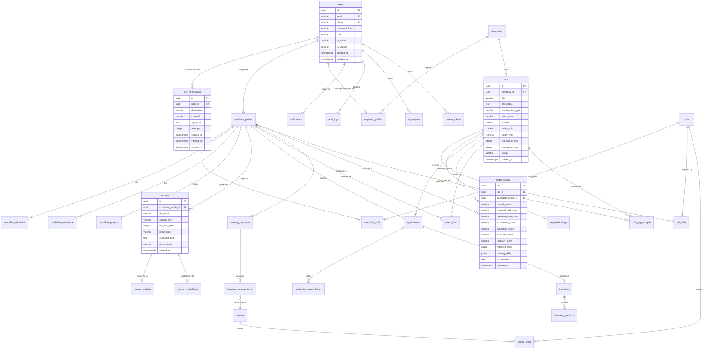

# Database Architecture & PostgreSQL Schema — CareerAI

## 1. Entity-Relationship Diagram (Mermaid)



---

## 2. PostgreSQL DDL Production Script

```sql
-- CareerAI Production Relational Database Schema
-- Enables cryptographic UUIDs and pgvector vector search

CREATE EXTENSION IF NOT EXISTS "pgcrypto";
CREATE EXTENSION IF NOT EXISTS "uuid-ossp";
CREATE EXTENSION IF NOT EXISTS vector;

-- 1. Users & Authentication
CREATE TABLE users (
    id UUID PRIMARY KEY DEFAULT gen_random_uuid(),
    email VARCHAR(255) UNIQUE,
    phone VARCHAR(30) UNIQUE,
    password_hash VARCHAR(255),
    role VARCHAR(30) NOT NULL CHECK (role IN ('CANDIDATE', 'EMPLOYER', 'ADMIN')),
    is_active BOOLEAN NOT NULL DEFAULT TRUE,
    is_verified BOOLEAN NOT NULL DEFAULT FALSE,
    created_at TIMESTAMPTZ NOT NULL DEFAULT CURRENT_TIMESTAMP,
    updated_at TIMESTAMPTZ NOT NULL DEFAULT CURRENT_TIMESTAMP
);

CREATE INDEX idx_users_email ON users(email);
CREATE INDEX idx_users_phone ON users(phone);
CREATE INDEX idx_users_role ON users(role);

-- 2. OTP Verifications (Email & SMS)
CREATE TABLE otp_verifications (
    id UUID PRIMARY KEY DEFAULT gen_random_uuid(),
    user_id UUID REFERENCES users(id) ON DELETE CASCADE,
    destination VARCHAR(255) NOT NULL,
    channel VARCHAR(20) NOT NULL CHECK (channel IN ('EMAIL', 'SMS')),
    otp_hash TEXT NOT NULL,
    attempts INTEGER NOT NULL DEFAULT 0 CHECK (attempts <= 5),
    expires_at TIMESTAMPTZ NOT NULL,
    verified_at TIMESTAMPTZ,
    created_at TIMESTAMPTZ NOT NULL DEFAULT CURRENT_TIMESTAMP
);

CREATE INDEX idx_otp_user ON otp_verifications(user_id);
CREATE INDEX idx_otp_destination ON otp_verifications(destination);
CREATE INDEX idx_otp_expires ON otp_verifications(expires_at);

-- 3. Refresh Tokens (Rotation & Revocation)
CREATE TABLE refresh_tokens (
    id UUID PRIMARY KEY DEFAULT gen_random_uuid(),
    user_id UUID NOT NULL REFERENCES users(id) ON DELETE CASCADE,
    token_hash VARCHAR(255) NOT NULL UNIQUE,
    is_revoked BOOLEAN NOT NULL DEFAULT FALSE,
    expires_at TIMESTAMPTZ NOT NULL,
    created_at TIMESTAMPTZ NOT NULL DEFAULT CURRENT_TIMESTAMP
);

CREATE INDEX idx_refresh_tokens_user ON refresh_tokens(user_id);

-- 4. Candidate Profiles
CREATE TABLE candidate_profiles (
    id UUID PRIMARY KEY DEFAULT gen_random_uuid(),
    user_id UUID NOT NULL UNIQUE REFERENCES users(id) ON DELETE CASCADE,
    first_name VARCHAR(100) NOT NULL,
    last_name VARCHAR(100) NOT NULL,
    headline VARCHAR(255),
    summary TEXT,
    location VARCHAR(150),
    preferred_work_mode VARCHAR(50) DEFAULT 'REMOTE' CHECK (preferred_work_mode IN ('REMOTE', 'HYBRID', 'ONSITE', 'FLEXIBLE')),
    years_of_experience NUMERIC(4,1) DEFAULT 0,
    github_url VARCHAR(255),
    linkedin_url VARCHAR(255),
    portfolio_url VARCHAR(255),
    is_open_to_work BOOLEAN DEFAULT TRUE,
    created_at TIMESTAMPTZ NOT NULL DEFAULT CURRENT_TIMESTAMP,
    updated_at TIMESTAMPTZ NOT NULL DEFAULT CURRENT_TIMESTAMP
);

-- 5. Companies
CREATE TABLE companies (
    id UUID PRIMARY KEY DEFAULT gen_random_uuid(),
    name VARCHAR(255) NOT NULL UNIQUE,
    slug VARCHAR(255) NOT NULL UNIQUE,
    website VARCHAR(255),
    logo_url TEXT,
    industry VARCHAR(100),
    company_size VARCHAR(50),
    location VARCHAR(150),
    about TEXT,
    is_verified BOOLEAN DEFAULT FALSE,
    created_at TIMESTAMPTZ NOT NULL DEFAULT CURRENT_TIMESTAMP,
    updated_at TIMESTAMPTZ NOT NULL DEFAULT CURRENT_TIMESTAMP
);

-- 6. Employer Profiles
CREATE TABLE employer_profiles (
    id UUID PRIMARY KEY DEFAULT gen_random_uuid(),
    user_id UUID NOT NULL UNIQUE REFERENCES users(id) ON DELETE CASCADE,
    company_id UUID NOT NULL REFERENCES companies(id) ON DELETE RESTRICT,
    title VARCHAR(150),
    department VARCHAR(100),
    created_at TIMESTAMPTZ NOT NULL DEFAULT CURRENT_TIMESTAMP
);

-- 7. Canonical Skills & Aliases Master Table
CREATE TABLE skills (
    id UUID PRIMARY KEY DEFAULT gen_random_uuid(),
    name VARCHAR(100) NOT NULL UNIQUE,
    normalized_name VARCHAR(100) NOT NULL UNIQUE,
    category VARCHAR(100) NOT NULL DEFAULT 'TECHNICAL',
    aliases TEXT[] DEFAULT '{}',
    is_verified BOOLEAN DEFAULT TRUE,
    created_at TIMESTAMPTZ NOT NULL DEFAULT CURRENT_TIMESTAMP
);

CREATE INDEX idx_skills_normalized ON skills(normalized_name);

-- 8. Candidate Skills
CREATE TABLE candidate_skills (
    id UUID PRIMARY KEY DEFAULT gen_random_uuid(),
    candidate_profile_id UUID NOT NULL REFERENCES candidate_profiles(id) ON DELETE CASCADE,
    skill_id UUID NOT NULL REFERENCES skills(id) ON DELETE CASCADE,
    proficiency_level VARCHAR(30) DEFAULT 'INTERMEDIATE' CHECK (proficiency_level IN ('BEGINNER', 'INTERMEDIATE', 'ADVANCED', 'EXPERT')),
    years_of_experience NUMERIC(4,1),
    is_verified BOOLEAN DEFAULT FALSE,
    created_at TIMESTAMPTZ NOT NULL DEFAULT CURRENT_TIMESTAMP,
    UNIQUE(candidate_profile_id, skill_id)
);

-- 9. Resumes & Private Storage
CREATE TABLE resumes (
    id UUID PRIMARY KEY DEFAULT gen_random_uuid(),
    candidate_profile_id UUID NOT NULL REFERENCES candidate_profiles(id) ON DELETE CASCADE,
    file_name VARCHAR(255) NOT NULL,
    storage_key VARCHAR(500) NOT NULL UNIQUE,
    file_size_bytes INTEGER NOT NULL CHECK (file_size_bytes <= 10485760),
    mime_type VARCHAR(100) NOT NULL,
    extracted_text TEXT,
    parse_status VARCHAR(50) NOT NULL DEFAULT 'PENDING' CHECK (parse_status IN ('PENDING', 'PROCESSING', 'COMPLETED', 'FAILED')),
    error_message TEXT,
    is_active BOOLEAN NOT NULL DEFAULT TRUE,
    created_at TIMESTAMPTZ NOT NULL DEFAULT CURRENT_TIMESTAMP
);

CREATE INDEX idx_resumes_candidate ON resumes(candidate_profile_id);

-- 10. Resume AI Analysis & ATS Scoring
CREATE TABLE resume_analysis (
    id UUID PRIMARY KEY DEFAULT gen_random_uuid(),
    resume_id UUID NOT NULL UNIQUE REFERENCES resumes(id) ON DELETE CASCADE,
    ats_score INTEGER NOT NULL CHECK (ats_score BETWEEN 0 AND 100),
    completeness_score INTEGER NOT NULL CHECK (completeness_score BETWEEN 0 AND 100),
    skills_score INTEGER NOT NULL CHECK (skills_score BETWEEN 0 AND 100),
    experience_score INTEGER NOT NULL CHECK (experience_score BETWEEN 0 AND 100),
    formatting_score INTEGER NOT NULL CHECK (formatting_score BETWEEN 0 AND 100),
    extracted_data JSONB NOT NULL DEFAULT '{}'::jsonb,
    strengths TEXT[] DEFAULT '{}',
    improvement_recommendations TEXT[] DEFAULT '{}',
    missing_keywords TEXT[] DEFAULT '{}',
    model_version VARCHAR(50) NOT NULL,
    created_at TIMESTAMPTZ NOT NULL DEFAULT CURRENT_TIMESTAMP
);

-- 11. Resume Vector Embeddings
CREATE TABLE resume_embeddings (
    id UUID PRIMARY KEY DEFAULT gen_random_uuid(),
    resume_id UUID NOT NULL UNIQUE REFERENCES resumes(id) ON DELETE CASCADE,
    embedding vector(768) NOT NULL,
    created_at TIMESTAMPTZ NOT NULL DEFAULT CURRENT_TIMESTAMP
);

-- 12. Jobs
CREATE TABLE jobs (
    id UUID PRIMARY KEY DEFAULT gen_random_uuid(),
    company_id UUID NOT NULL REFERENCES companies(id) ON DELETE CASCADE,
    title VARCHAR(200) NOT NULL,
    description TEXT NOT NULL,
    responsibilities TEXT[] DEFAULT '{}',
    requirements TEXT[] DEFAULT '{}',
    employment_type VARCHAR(50) NOT NULL DEFAULT 'FULL_TIME' CHECK (employment_type IN ('FULL_TIME', 'PART_TIME', 'CONTRACT', 'INTERNSHIP')),
    work_mode VARCHAR(50) NOT NULL DEFAULT 'REMOTE' CHECK (work_mode IN ('REMOTE', 'HYBRID', 'ONSITE')),
    location VARCHAR(150) NOT NULL,
    salary_min NUMERIC(12,2),
    salary_max NUMERIC(12,2),
    salary_currency VARCHAR(10) DEFAULT 'USD',
    experience_min INTEGER NOT NULL DEFAULT 0,
    experience_max INTEGER,
    number_of_openings INTEGER NOT NULL DEFAULT 1,
    status VARCHAR(30) NOT NULL DEFAULT 'ACTIVE' CHECK (status IN ('DRAFT', 'ACTIVE', 'PAUSED', 'CLOSED', 'EXPIRED')),
    application_deadline TIMESTAMPTZ,
    search_vector tsvector,
    created_at TIMESTAMPTZ NOT NULL DEFAULT CURRENT_TIMESTAMP,
    updated_at TIMESTAMPTZ NOT NULL DEFAULT CURRENT_TIMESTAMP
);

CREATE INDEX idx_jobs_company ON jobs(company_id);
CREATE INDEX idx_jobs_status ON jobs(status);
CREATE INDEX idx_jobs_search ON jobs USING gin(search_vector);

-- 13. Job Skills Mapping
CREATE TABLE job_skills (
    id UUID PRIMARY KEY DEFAULT gen_random_uuid(),
    job_id UUID NOT NULL REFERENCES jobs(id) ON DELETE CASCADE,
    skill_id UUID NOT NULL REFERENCES skills(id) ON DELETE CASCADE,
    is_required BOOLEAN NOT NULL DEFAULT TRUE,
    min_years_experience NUMERIC(4,1) DEFAULT 0,
    UNIQUE(job_id, skill_id)
);

-- 14. Job Vector Embeddings
CREATE TABLE job_embeddings (
    id UUID PRIMARY KEY DEFAULT gen_random_uuid(),
    job_id UUID NOT NULL UNIQUE REFERENCES jobs(id) ON DELETE CASCADE,
    embedding vector(768) NOT NULL,
    created_at TIMESTAMPTZ NOT NULL DEFAULT CURRENT_TIMESTAMP
);

-- 15. Job Applications
CREATE TABLE applications (
    id UUID PRIMARY KEY DEFAULT gen_random_uuid(),
    job_id UUID NOT NULL REFERENCES jobs(id) ON DELETE CASCADE,
    candidate_profile_id UUID NOT NULL REFERENCES candidate_profiles(id) ON DELETE CASCADE,
    resume_id UUID NOT NULL REFERENCES resumes(id) ON DELETE RESTRICT,
    cover_letter TEXT,
    current_status VARCHAR(50) NOT NULL DEFAULT 'APPLIED' CHECK (current_status IN (
        'APPLIED', 'SCREENING', 'SHORTLISTED', 'INTERVIEW', 'SELECTED', 'REJECTED', 'WITHDRAWN'
    )),
    match_score_at_apply NUMERIC(5,2),
    applied_at TIMESTAMPTZ NOT NULL DEFAULT CURRENT_TIMESTAMP,
    updated_at TIMESTAMPTZ NOT NULL DEFAULT CURRENT_TIMESTAMP,
    UNIQUE(job_id, candidate_profile_id)
);

-- 16. Application Status Audit History
CREATE TABLE application_status_history (
    id UUID PRIMARY KEY DEFAULT gen_random_uuid(),
    application_id UUID NOT NULL REFERENCES applications(id) ON DELETE CASCADE,
    from_status VARCHAR(50),
    to_status VARCHAR(50) NOT NULL,
    changed_by_user_id UUID REFERENCES users(id) ON DELETE SET NULL,
    note TEXT,
    created_at TIMESTAMPTZ NOT NULL DEFAULT CURRENT_TIMESTAMP
);

-- 17. Explainable Match Results
CREATE TABLE match_results (
    id UUID PRIMARY KEY DEFAULT gen_random_uuid(),
    job_id UUID NOT NULL REFERENCES jobs(id) ON DELETE CASCADE,
    candidate_profile_id UUID NOT NULL REFERENCES candidate_profiles(id) ON DELETE CASCADE,
    overall_score NUMERIC(5,2) NOT NULL CHECK (overall_score BETWEEN 0 AND 100),
    required_skill_score NUMERIC(5,2) NOT NULL,
    preferred_skill_score NUMERIC(5,2) NOT NULL,
    experience_score NUMERIC(5,2) NOT NULL,
    education_score NUMERIC(5,2) NOT NULL,
    semantic_score NUMERIC(5,2) NOT NULL,
    location_score NUMERIC(5,2) NOT NULL,
    matched_skills TEXT[] DEFAULT '{}',
    missing_skills TEXT[] DEFAULT '{}',
    explanation TEXT NOT NULL,
    weights_used JSONB NOT NULL DEFAULT '{"required_skills": 0.40, "preferred_skills": 0.20, "experience": 0.15, "education": 0.10, "semantic": 0.10, "location": 0.05}'::jsonb,
    calculated_at TIMESTAMPTZ NOT NULL DEFAULT CURRENT_TIMESTAMP,
    UNIQUE(job_id, candidate_profile_id)
);

-- 18. Skill Gap Analysis
CREATE TABLE skill_gap_analysis (
    id UUID PRIMARY KEY DEFAULT gen_random_uuid(),
    candidate_profile_id UUID NOT NULL REFERENCES candidate_profiles(id) ON DELETE CASCADE,
    job_id UUID NOT NULL REFERENCES jobs(id) ON DELETE CASCADE,
    skill_gaps JSONB NOT NULL DEFAULT '[]'::jsonb,
    summary TEXT,
    created_at TIMESTAMPTZ NOT NULL DEFAULT CURRENT_TIMESTAMP
);

-- 19. Courses & Curriculum Catalog
CREATE TABLE courses (
    id UUID PRIMARY KEY DEFAULT gen_random_uuid(),
    title VARCHAR(255) NOT NULL,
    provider VARCHAR(100) NOT NULL,
    external_url VARCHAR(500) NOT NULL,
    duration_hours INTEGER,
    level VARCHAR(50) DEFAULT 'BEGINNER',
    description TEXT,
    is_active BOOLEAN DEFAULT TRUE,
    created_at TIMESTAMPTZ NOT NULL DEFAULT CURRENT_TIMESTAMP
);

-- 20. Course Skills Mapping
CREATE TABLE course_skills (
    id UUID PRIMARY KEY DEFAULT gen_random_uuid(),
    course_id UUID NOT NULL REFERENCES courses(id) ON DELETE CASCADE,
    skill_id UUID NOT NULL REFERENCES skills(id) ON DELETE CASCADE,
    UNIQUE(course_id, skill_id)
);

-- 21. Learning Roadmaps
CREATE TABLE learning_roadmaps (
    id UUID PRIMARY KEY DEFAULT gen_random_uuid(),
    candidate_profile_id UUID NOT NULL REFERENCES candidate_profiles(id) ON DELETE CASCADE,
    target_role VARCHAR(150) NOT NULL,
    status VARCHAR(50) DEFAULT 'ACTIVE',
    created_at TIMESTAMPTZ NOT NULL DEFAULT CURRENT_TIMESTAMP
);

CREATE TABLE learning_roadmap_items (
    id UUID PRIMARY KEY DEFAULT gen_random_uuid(),
    roadmap_id UUID NOT NULL REFERENCES learning_roadmaps(id) ON DELETE CASCADE,
    skill_id UUID NOT NULL REFERENCES skills(id) ON DELETE CASCADE,
    course_id UUID REFERENCES courses(id) ON DELETE SET NULL,
    step_order INTEGER NOT NULL,
    status VARCHAR(50) DEFAULT 'PENDING' CHECK (status IN ('PENDING', 'IN_PROGRESS', 'COMPLETED')),
    priority VARCHAR(30) DEFAULT 'HIGH' CHECK (priority IN ('HIGH', 'MEDIUM', 'LOW'))
);

-- 22. Interviews & Question Prep
CREATE TABLE interviews (
    id UUID PRIMARY KEY DEFAULT gen_random_uuid(),
    application_id UUID NOT NULL REFERENCES applications(id) ON DELETE CASCADE,
    scheduled_at TIMESTAMPTZ,
    meeting_link VARCHAR(500),
    interviewer_notes TEXT,
    status VARCHAR(50) DEFAULT 'SCHEDULED' CHECK (status IN ('SCHEDULED', 'COMPLETED', 'CANCELLED', 'RESCHEDULED')),
    created_at TIMESTAMPTZ NOT NULL DEFAULT CURRENT_TIMESTAMP
);

CREATE TABLE interview_questions (
    id UUID PRIMARY KEY DEFAULT gen_random_uuid(),
    interview_id UUID REFERENCES interviews(id) ON DELETE CASCADE,
    candidate_profile_id UUID NOT NULL REFERENCES candidate_profiles(id) ON DELETE CASCADE,
    job_id UUID NOT NULL REFERENCES jobs(id) ON DELETE CASCADE,
    category VARCHAR(50) NOT NULL CHECK (category IN ('HR', 'TECHNICAL', 'PROJECT', 'BEHAVIORAL', 'SYSTEM_DESIGN')),
    question TEXT NOT NULL,
    sample_answer_hint TEXT,
    created_at TIMESTAMPTZ NOT NULL DEFAULT CURRENT_TIMESTAMP
);

-- 23. Saved Jobs & Bookmarks
CREATE TABLE saved_jobs (
    id UUID PRIMARY KEY DEFAULT gen_random_uuid(),
    candidate_profile_id UUID NOT NULL REFERENCES candidate_profiles(id) ON DELETE CASCADE,
    job_id UUID NOT NULL REFERENCES jobs(id) ON DELETE CASCADE,
    created_at TIMESTAMPTZ NOT NULL DEFAULT CURRENT_TIMESTAMP,
    UNIQUE(candidate_profile_id, job_id)
);

-- 24. Notifications (In-App & Email/SMS)
CREATE TABLE notifications (
    id UUID PRIMARY KEY DEFAULT gen_random_uuid(),
    user_id UUID NOT NULL REFERENCES users(id) ON DELETE CASCADE,
    title VARCHAR(200) NOT NULL,
    message TEXT NOT NULL,
    type VARCHAR(50) NOT NULL,
    action_url VARCHAR(255),
    is_read BOOLEAN NOT NULL DEFAULT FALSE,
    created_at TIMESTAMPTZ NOT NULL DEFAULT CURRENT_TIMESTAMP
);

CREATE INDEX idx_notifications_user ON notifications(user_id, is_read);

-- 25. Security & System Audit Logs
CREATE TABLE audit_logs (
    id UUID PRIMARY KEY DEFAULT gen_random_uuid(),
    user_id UUID REFERENCES users(id) ON DELETE SET NULL,
    action VARCHAR(100) NOT NULL,
    entity_type VARCHAR(100) NOT NULL,
    entity_id VARCHAR(100),
    metadata JSONB DEFAULT '{}'::jsonb,
    ip_address VARCHAR(50),
    user_agent TEXT,
    created_at TIMESTAMPTZ NOT NULL DEFAULT CURRENT_TIMESTAMP
);

CREATE INDEX idx_audit_user ON audit_logs(user_id);
CREATE INDEX idx_audit_action ON audit_logs(action);

-- 26. AI Requests Telemetry & Quota Audit
CREATE TABLE ai_requests (
    id UUID PRIMARY KEY DEFAULT gen_random_uuid(),
    user_id UUID REFERENCES users(id) ON DELETE SET NULL,
    request_type VARCHAR(100) NOT NULL,
    model VARCHAR(100) NOT NULL,
    prompt_version VARCHAR(50) NOT NULL,
    prompt_tokens INTEGER,
    completion_tokens INTEGER,
    latency_ms INTEGER NOT NULL,
    status VARCHAR(50) NOT NULL CHECK (status IN ('SUCCESS', 'FAILED', 'RATE_LIMITED')),
    error_message TEXT,
    created_at TIMESTAMPTZ NOT NULL DEFAULT CURRENT_TIMESTAMP
);

CREATE INDEX idx_ai_requests_user ON ai_requests(user_id);
```
